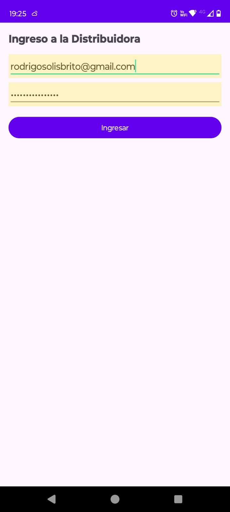
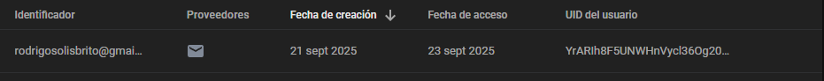
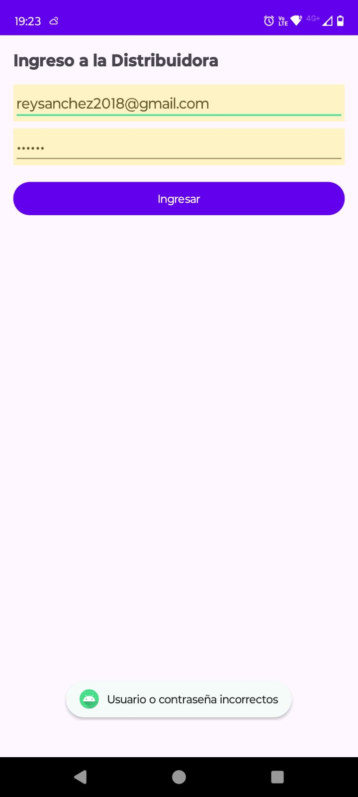
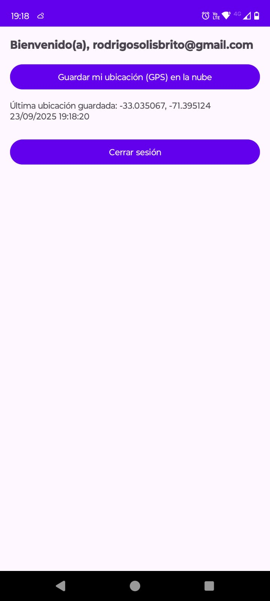
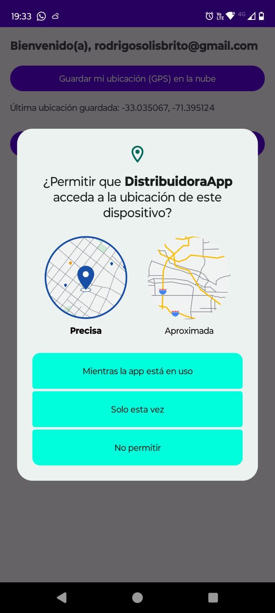
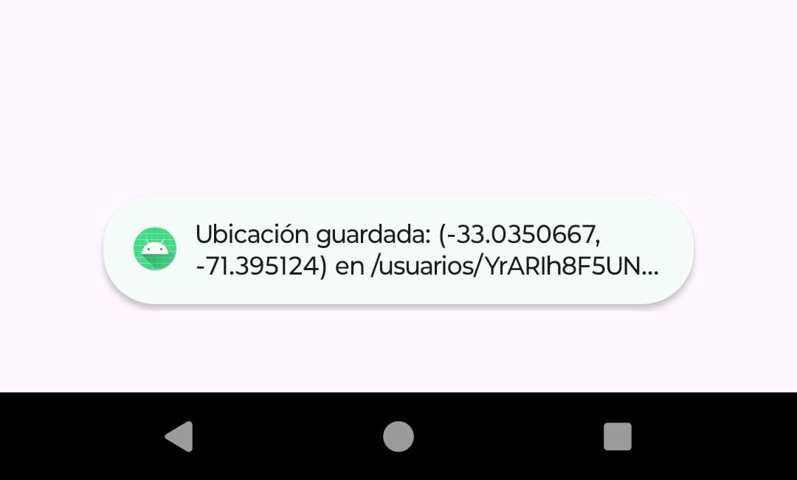
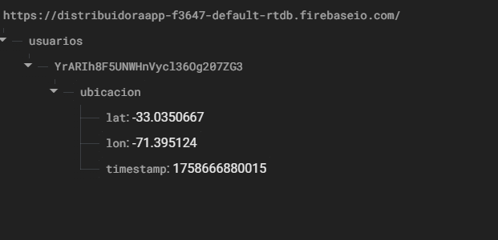
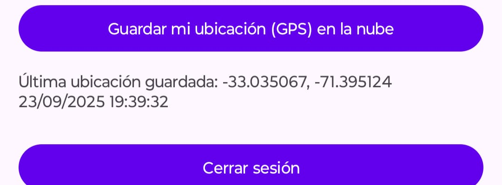
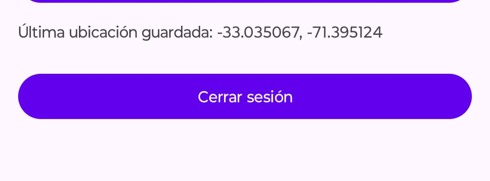

# Historias de Usuario - DistribuidoraApp

## HU1: Iniciar sesión con credenciales válidas
**Historia:**  
Como usuario registrado, quiero poder ingresar con mi correo y contraseña, para acceder al sistema de la distribuidora.

**Criterios de aceptación:**
- Al ingresar credenciales correctas, debo acceder al menú principal.
- Debe validarse con Firebase Authentication.

**Evidencias:**  
  

---

## HU2: Manejo de credenciales inválidas
**Historia:**  
Como usuario, quiero recibir un mensaje claro cuando ingreso mal mis credenciales, para entender el error.

**Criterios de aceptación:**
- Si el correo no existe o la clave es incorrecta, debe aparecer un mensaje.
- No se debe acceder al menú principal.

**Evidencias:**  

---

## HU3: Acceso al menú principal
**Historia:**  
Como usuario autenticado, quiero ver un menú con mi correo, para sentir que la aplicación reconoce mi sesión.

**Criterios de aceptación:**
- El menú debe mostrar un saludo con el correo del usuario autenticado.
- Debe ofrecer opciones de guardar ubicación y cerrar sesión.

**Evidencias:**  

---

## HU4: Guardar ubicación GPS en Firebase
**Historia:**  
Como usuario autenticado, quiero guardar mi ubicación GPS, para que quede registrada en la base de datos.

**Criterios de aceptación:**
- Al presionar “Guardar ubicación” deben solicitarse permisos de ubicación.
- Si los permisos son aceptados, se debe guardar latitud, longitud y timestamp en Firebase.
- Se debe mostrar un mensaje confirmando que la ubicación fue guardada.

**Evidencias:**  
  
  

---

## HU5: Mostrar última ubicación guardada
**Historia:**  
Como usuario autenticado, quiero ver en pantalla mi última ubicación guardada, para confirmar que la app funciona.

**Criterios de aceptación:**
- Al abrir el menú, debe mostrarse la última ubicación registrada.
- Si no existe, debe mostrarse un guion (—).

**Evidencias:**  

---

## HU6: Cierre de sesión
**Historia:**  
Como usuario, quiero poder cerrar sesión, para evitar que alguien más use mi cuenta en el dispositivo.

**Criterios de aceptación:**
- Al presionar “Cerrar sesión”, debo volver a la pantalla de login.
- No debe ser posible regresar al menú con el botón atrás.

**Evidencias:**  

---
